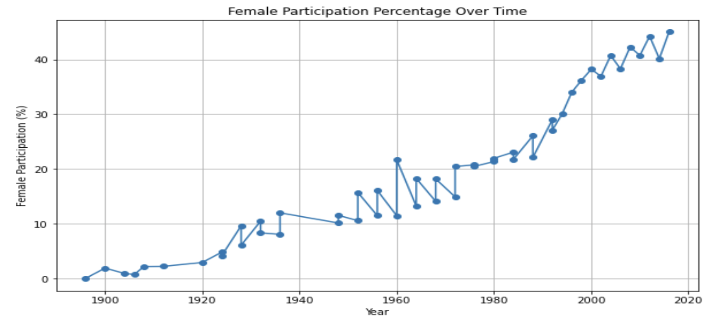
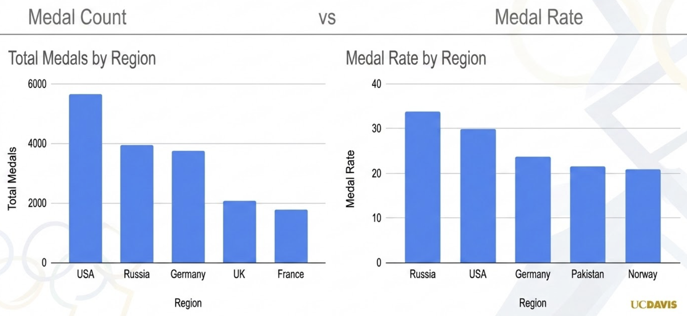
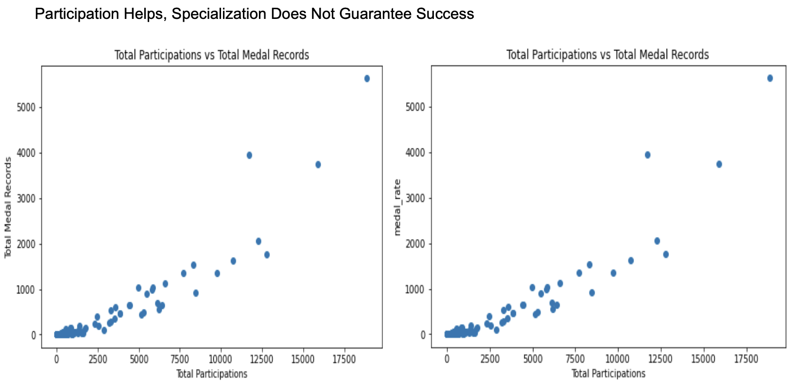
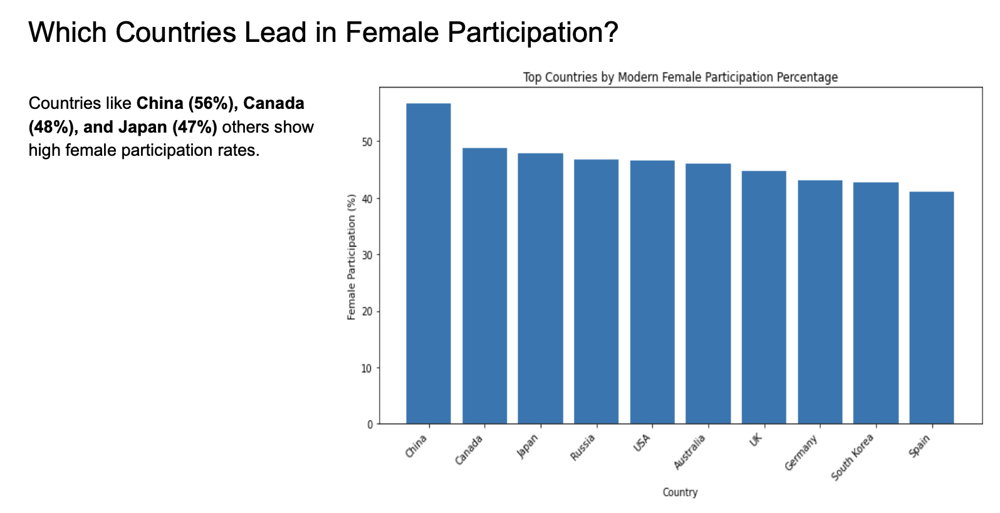

# Beyond the Medal Table: Olympic SQL Analysis

This case study explores 120 years of Olympic athlete-event data to understand medal efficiency, female participation growth, and sport-specific athlete profile trends.

The project demonstrates practical SQL and data analysis skills, including data preparation, exploratory analysis, metric creation, trend analysis, and communicating findings for a business audience.

---

## 📋 Project Index

1. Executive Summary

2. Key Visuals

3. Dataset & Project Context

4. ERD / Data Model

5. SQL Workflow
   - SQL: Data Preparation
   - SQL: Exploratory Data Analysis
   - SQL: Deeper Analysis

6. Main Findings

7. Final Recommendations

8. Presentation of Findings

---

## 🎯 Executive Summary

### Context

This project was created for **SportsStats**, a sports analytics firm that provides insights for sports media, local news, elite trainers, and sports science partners.

### Business Problem

Traditional Olympic analysis often focuses only on the medal table. However, total medal count does not fully explain Olympic success. It does not show medal efficiency, long-term participation changes, or how athlete profiles differ by sport.

### Business Question

Using Olympic athlete-event data from 1896 to 2016, what deeper patterns can be found beyond the traditional medal table, and how can these insights be used for media storytelling and sports performance analysis?

### Project Goal

The goal of this project was to use SQL to explore:

- How Olympic success changes when measured by total medal records versus medal rate
- How female Olympic participation has changed over time
- Whether medalists have a distinct physical profile compared with non-medalists
- Whether athlete physical trends are more meaningful when analyzed by sport

---

## 📊 Key Visuals

The visuals below summarize the main insights from the analysis.

### 1. Female Participation Over Time

This chart shows the long-term growth in female Olympic participation across Summer and Winter Olympics.

### 2. Medal Count vs Medal Rate

This visual compares countries by total medal records and medal rate, showing that Olympic success changes depending on the metric used.

### 3. Participation vs Medal Records

This scatter plot shows the relationship between total participation records and total medal records. Countries with more participation generally have more medal opportunities.

### 4. Female Participation by Country

This chart highlights countries with strong modern female participation rates.

### 5. Sport-Specific Physical Trends

This chart shows how medalist physical profiles changed over time in selected sports such as Athletics, Gymnastics, and Swimming.

---

## 🗂️ Dataset & Project Context

The project uses Olympic athlete-event data covering the period from **1896 to 2016**.

The dataset contains approximately:

- 270,000 Olympic records
- 35,000 athletes
- 230 countries
- 66 sports
- 765 events

A key limitation is that the dataset is at the **athlete-event level**. This means medal counts are reported as **medal records**, because team sports can create multiple medal rows for one official team medal.

Another limitation is that historical country changes affect interpretation. For example, Russia/Soviet-region includes historical Olympic codes such as `URS`, `EUN`, and `RUS`.

---

## 🧩 ERD / Data Model

## 💻 SQL Workflow

The project was completed using SQL in a Jupyter Notebook environment. The workflow moved from data preparation to exploratory analysis and then deeper analysis.

### 1. SQL: Data Preparation

**File:** `olympics_sql_analysis.ipynb`  
**Link:** [Paste notebook link here]()

In this phase, I prepared the Olympic dataset for analysis by loading the two main tables, reviewing the structure of the data, checking table joins, and identifying important limitations.

Key steps included:

- Loading `athlete_events` and `noc_regions`
- Joining tables using `NOC`
- Checking missing values in key fields such as `Age`, `Height`, `Weight`, `Medal`, `region`, and `notes`
- Identifying historical NOC limitations
- Creating a cleaner foundation for later analysis

This stage was important because some fields, especially height and weight, had significant missing values. Physical profile analysis therefore required extra care.

---

### 2. SQL: Exploratory Data Analysis (EDA)

**File:** `olympics_sql_analysis.ipynb`  
**Link:** [Paste notebook link here]()

In this phase, I explored the dataset to understand participation, country representation, medal records, gender trends, and sport-level patterns.

Key analysis included:

- Total athletes, countries, sports, events, seasons, and Olympic years
- Participation trends over time
- Female participation by year and season
- Medal records by country and season
- Countries with high medal rates
- Sports with the largest number of records
- Missing data patterns in physical attributes

This stage helped identify the strongest directions for deeper analysis: medal efficiency, female participation growth, and sport-specific athlete profiles.

---

### 3. SQL: Deeper Analysis

**File:** `olympics_sql_analysis.ipynb`  
**Link:** [Paste notebook link here]()

In this phase, I moved beyond descriptive statistics and created more analytical metrics to answer the main project questions.

Key analysis included:

- Comparing total medal records with medal rate
- Measuring the relationship between country participation and medal success
- Testing whether sport specialization predicted medal performance
- Comparing medalists and non-medalists by age, height, and weight
- Analyzing sport-specific physical trends over time
- Reviewing female participation growth by country and sport

This phase turned the raw data exploration into business-facing insights for SportsStats.

---

## 🔍 Main Findings

### 1. Olympic success depends on the metric

Total medal count and medal rate tell different stories.

Medal count reflects overall scale and total success, while medal rate reflects efficiency. The USA leads strongly in total medal records, but Russia/Soviet-region performs especially well when medal rate is considered.

This shows that the traditional medal table is only one way to understand Olympic success.

---

### 2. Participation helps, but specialization does not guarantee success

Countries with more participation records generally have more medal records. This makes sense because more participation creates more opportunities to win.

However, concentrating a high share of participation in one sport did not automatically lead to stronger medal performance.

This suggests that medal success depends on more than participation volume alone. Other factors such as athlete quality, coaching, funding, facilities, and competitive depth likely matter.

---

### 3. Female participation has grown massively

Female Olympic participation increased from very low levels in the early Olympics to around 45% in the Summer Olympics by 2016.

This creates a strong media story because it shows how much the Olympics have changed over time, both in size and gender representation.

The growth also varied by country and sport, which creates opportunities for more targeted storytelling.

---

### 4. There is no universal Olympic winner's body type

Basic physical attributes such as age, height, and weight had weak relationships with medal status overall.

The more useful insight was sport-specific. Gymnastics, Swimming, and Athletics showed different physical trends over time, suggesting that athlete profile analysis should be done by sport rather than across all Olympic athletes.

---

## ✅ Final Recommendations

### For Sports Media / Local News

SportsStats should build stories around:

- Medal count versus medal rate
- USA versus Russia/Soviet-region comparisons
- Female participation growth by country and sport
- Countries or sports that are more efficient than expected

These angles create more interesting stories than simply repeating the traditional Olympic medal table.

---

### For Elite Trainers / Sports Science Partners

SportsStats should focus on:

- Sport-specific athlete profile trends
- How age, height, and weight differ across sports
- How medalist profiles have changed over time
- Event-level analysis instead of broad Olympic averages

The analysis does not support a universal Olympic winner's body type. Instead, physical trends should be studied within specific sports and events.

---

### For Future Analysis

Future analysis could be improved by adding external data such as:

- GDP
- Population
- Sports funding
- Olympic investment
- Coaching infrastructure
- Event-level performance data

This would help explain national Olympic success more deeply and move the project from descriptive analysis toward stronger causal or strategic analysis.

---

## ✅ Presentation of Findings

**File:** `olympics_capstone_presentation.pptx`  
**Link:** [Paste PowerPoint or Google Slides link here]()

This presentation summarizes the full analysis in a stakeholder-friendly format. It focuses on the main story that Olympic success goes beyond the traditional medal table.

The presentation covers:

- Project context and audience
- Dataset overview and limitations
- Medal count versus medal rate
- Participation and medal success
- Female participation growth
- Sport-specific athlete profile trends
- Recommendations for SportsStats

